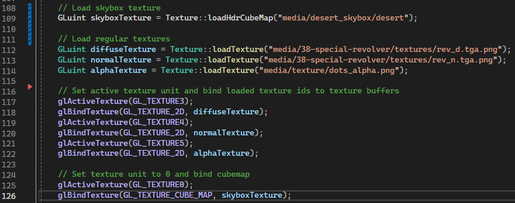

# COMP3015 Coursework 1
An OpenGL project utilizing a custom shading model implemented in GLSL, with custom lighting set up, showcasing a textured based technique.

This project has been written and tested using Visual Studio 2022 on a Windows 10 machine.

Custom Revolver Model: https://sketchfab.com/3d-models/38-special-revolver-3246c31648204534a2c6d671fe38452e

The main files to look at are the following:
- scenebasic_uniform.h + scenebasic_uniform.cpp
- basic_uniform.vert + basic_uniform.frag
- plane.vert + plane.frag
- skybox.vert + skybox.frag

## YouTube Video Walkthrough
YouTube Video: [insert here]

## Basic Lighting - Blinnphong in Fragment Shader
Seen in basic_uniform.frag as the blinnphongSpot function, which is adapted for spotlights.

## Basic Texture Sampling
Seen in basic_uniform.frag as part of the blinnphongSpot function, using the sampled texture colour instead of the material colour.

## Lighting subtechniques - Multilight + Spotlight
The scene uses multiple spotlights to provide lighting.

## Texturing subtechniques

### Alpha Discard
An alpha map is used to create a disintegration effect.

### Normal Mapping
A normal map is used to calculate normals for lighting.

## Skybox
A skybox is loaded in as a cubemap. The view is set at (0,0,0) before rendering to make the skybox seem infinite.

## Light Animation
In the update function, an angle is updated every frame. This angle is used to rotate the lights.

## Image Processing Techniques
Multiple image processing techniques have been combined, primarily to create the Bloom effect.

### HDR + Tone Mapping
Applied in pass 5.

### Bloom
Luminance checks done in pass 2, and blurring is applied additively in pass 5 with HDR.

### Gaussian Blur
Applied in passes 3 and 4 for y and x directions respectively.

### Gamma Correction
Applied to the result of pass 5 for the final image.

## Keyboard Scene/Animation Controls
Keyboard input is checked in update function:
Move Camera Around - WASD
Toggle Alpha Map - 1
Toggle RGB/White Lights - 2
Toggle Bloom - 3

## Mouse Scene/Animation Controls
Mouse input is checked in update function:
Rotate Camera - Move Mouse Around

